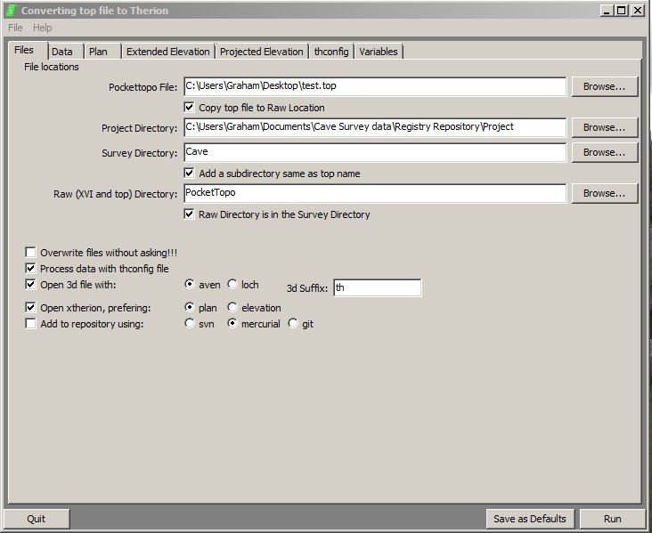
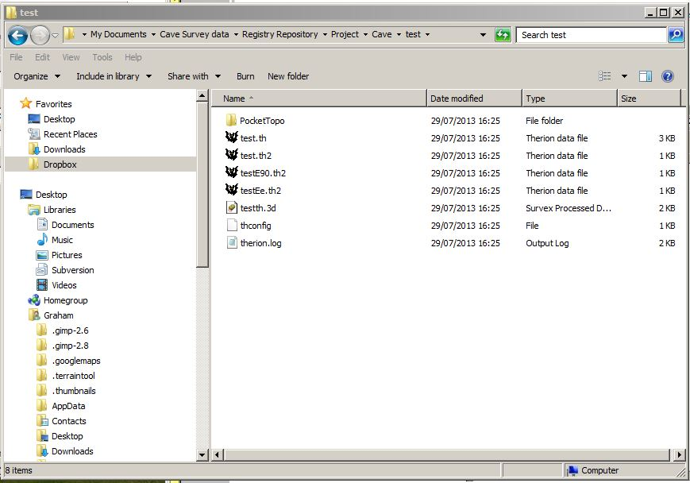
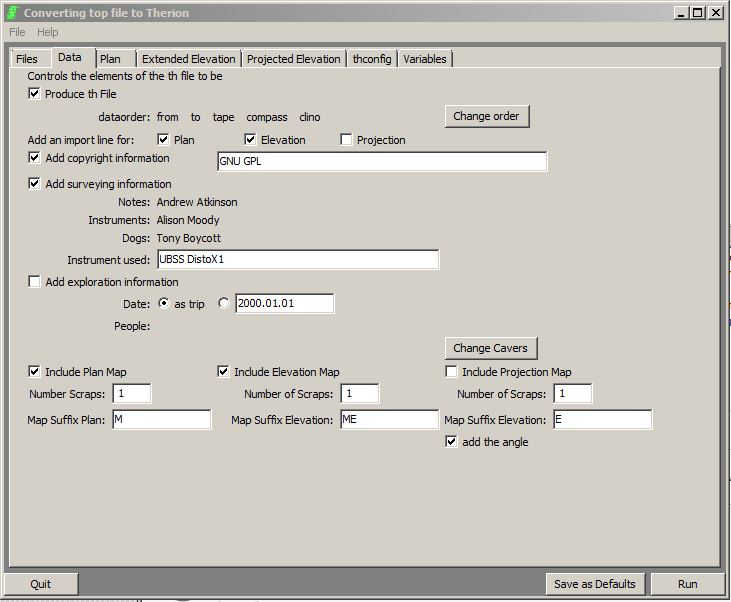
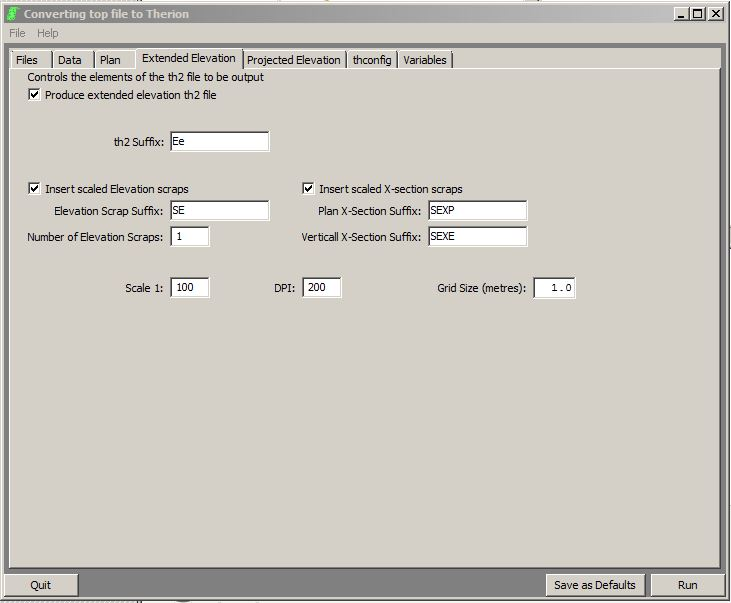
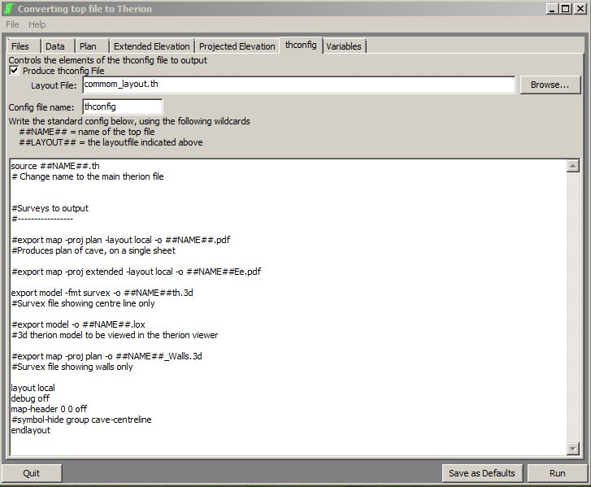

# Converting Pocket Topo files to Therion
## Guide written by an Idiot for the benefit of other idiots
 
*This note describes how to use the TopParser.exe program under Windows.*

TopParser is a program written to convert a PocketTopo file into Therion, producing all the files necessary to draw a cave survey. It will also automatically run X-Therion and produce a 3d file.

It is an executable file that does not require installing on a Windows computer. You do need to keep it in the same directory as all the ancillary files that come zipped with it, though.

This means that you cannot simply click on a Pocket Topo file and run the program from there but you must, rather, run the .exe file and then give it a file to process. The location of this file does not matter. It can be, for example, on a portable device, usb drive or anywhere on the computer. In the example here I have already put it in a folder named test.

## Creating the output directory
An output directory does need to exist as well. If this particular survey is part of a larger survey of a cave system then the output directory needs to be the cave survey project directory. In the example given here, the current survey (test) is part of the overall survey of a cave (Cave) with is part of a larger project (Project).

- Ticking the box labelled **'Copy top file to Raw location'** means that the raw data is automatically archived.

- Ticking the box labelled **'Add a subdirectory same as top name'** should be self-evident. If this is not ticked then the generated files will simply be added to the Survey Directory (here called 'Cave'). 

- Ticking the box labelled **'Raw directory in the Survey Directory'** means that the raw data is archived in the same place as the generated data.

Having started the TopParser.exe and browsed for the two locations, source and output, we have a window onscreen looking like the screen shot above. This is actually all that is needed, as with the boxes ticked as shown, the th, th2 (plan, extended and projected elevations) and thconfig files will be produced and placed in the sub directory 'test'. 

A copy of the .top file along with the generated plan and elevation 'xvi files will be placed in a further sub directory 'PocketTopo' of the directory 'test'.
If you are working with a project team, or are simply archiving your data to an online repository, this can also be set to upload the files automatically using subversion tools.

The output subdirectory will then look like this:

When the program is run, X-therion will also have run, produced an output Survex .3d file and opened it in Aven as well. This does depend, however, on what is in the thconfig file. *(See 'Sixth tab' below.)*

### Second tab (Data)
The **second tab** on the TopParser window **‘Data’** controls the elements of the th file. These should be self-explanatory to anyone used to using Therion.

The **‘change order’** button produces a box with one button. Pressing that button a given number of times will move the first element in the dataorder list along by that number of places. *(If you really want to, that is.)*

The **'change cavers'** button will open a box that allows you to define which cavers were involved in the survey and what role they played. This sort of information can later be extracted and analysed in Therion. This is now fully editable to add more caver's names (and delete those that are there by default).

### Third, fourth and fifth tabs
The **third, fourth and fifth tabs** control the elements of the plan and elevation th2 files. The naming conventions shown are those used by us in the Cheddar catchment project and elsewhere. The variables most likely to need changing here are those controlling the scale, depending on how much cave has actually been surveyed.  

### Sixth tab (thconfig)
The **sixth tab** controls the thconfig file. It essentially produces a simple thconfig with commands to output various types of file. This should be familiar to anyone using Therion. *(This is not the place to discuss these.)*

The line that asks for a **'Layout File'**, here named 'common_layout', is an advanced function not yet fully implemented. Such files are used like this to ensure a similarity of appearance between output files from different parts of the same project. It is not an essential feature and can, at present, be ignored by new users.

### Final tab (Variables)
The **final tab** simply controls the default locations of the various parts of Survex and Therion required to open and run files automatically. Many windows users will not need to do anything here, as the locations are standard ones. 

Users of 64 bit versions of Windows will find that they need to edit the locations to those shown in Figure 4, as Windows differentiates between program files written for 32 bit versions and those suitable only for 64 bit versions.

Having set (or ignored) these variables, press **“run”**. All being well, the program will generate all the required files and will also open the 3d file in aven for viewing and the th2 file in XTherion ready for drawing. It will also open a log file in which you can see what has been done & if there are any problems that need fixing.

*Graham Mullan - Updated July 2013*
     